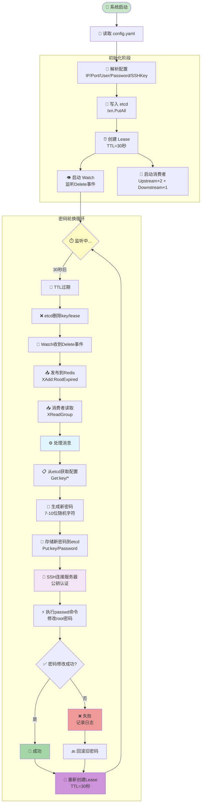

# RootPasswordManager
自动管理企业服务器root密码

```mermaid
flowchart TB
    Start([🚀 系统启动]) --> Config[📄 读取 config.yaml]
    Config --> Parse[🔧 解析配置\nIP/Port/User/Password/SSHKey]

    subgraph "初始化阶段"
        Parse --> EtcdWrite[💾 写入 etcd\ntxn.PutAll]
        EtcdWrite --> Lease[⏰ 创建 Lease\nTTL=30秒]
        Lease --> Watch[👁️ 启动 Watch\n监听Delete事件]
        Lease --> Consumer[🔄 启动消费者\nUpstream×2 + Downstream×1]
    end

    Watch --> Monitor{⏱️ 监听中...}

    subgraph "密码轮换循环"
        Monitor -->|30秒后| Expire[🔔 TTL过期]
        Expire --> Delete[❌ etcd删除key/lease]
        Delete --> Event[📡 Watch收到Delete事件]
        Event --> Publish[📤 发布到Redis\nXAdd:RootExpired]
        Publish --> Consume[📥 消费者读取\nXReadGroup]
        Consume --> Process[⚙️ 处理消息]

        Process --> GetConfig[📋 从etcd获取配置\nGet:key/*]
        GetConfig --> GenPass[🔑 生成新密码\n7-10位随机字符]
        GenPass --> StorePass[💾 存储新密码到etcd\nPut:key/Password]
        StorePass --> SSH[🔌 SSH连接服务器\n公钥认证]
        SSH --> Execute[⚡ 执行passwd命令\n修改root密码]

        Execute --> Check{✅ 密码修改成功?}

        Check -->|是| Success[🎉 成功]
        Check -->|否| Fail[❌ 失败\n记录日志]

        Success --> NewLease[🔄 重新创建Lease\nTTL=30秒]
        Fail --> Rollback[🔙 回滚旧密码]
        Rollback --> NewLease

        NewLease --> Monitor
    end

    style Start fill:#c8e6c9
    style Monitor fill:#fff9c4
    style Process fill:#e1f5fe
    style SSH fill:#f3e5f5
    style Success fill:#a5d6a7
    style Fail fill:#ef9a9a
    style NewLease fill:#ce93d8
```
