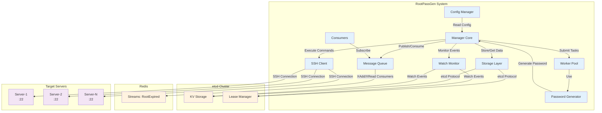
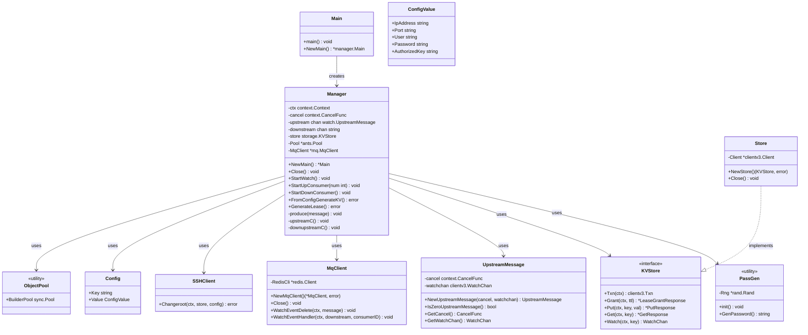
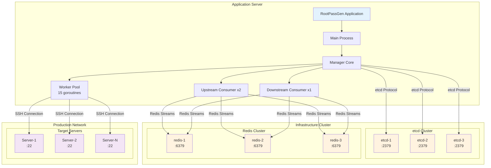
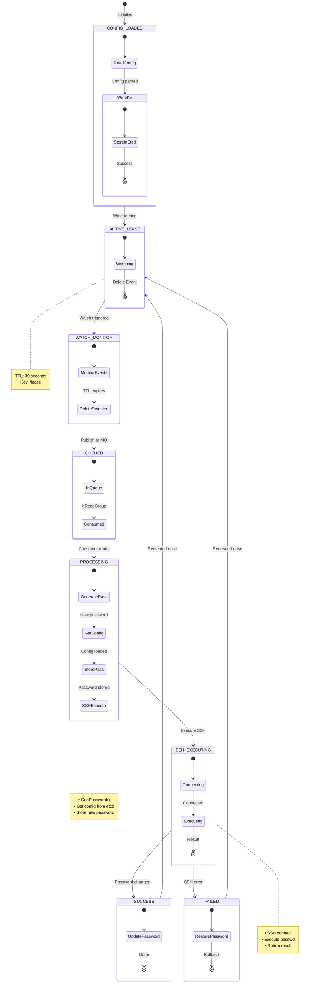
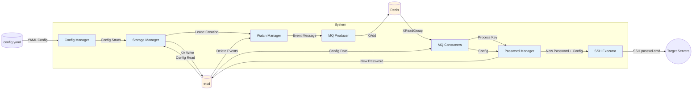

# RootPassGen 系统架构图

## 1. 组件图 (Component Diagram)

展示系统各组件及其关系



---

## 2. 类图 (Class Diagram)

核心类的结构和接口定义



---

## 3. 序列图 (Sequence Diagram)

密码轮换完整流程

```mermaid
sequenceDiagram
    actor Admin as Admin
    participant Main as Main
    participant Manager as Manager
    participant Config as Config
    participant Storage as Storage
    participant etcd as etcd
    participant PassGen as PassGen
    participant Watch as Watch
    participant Redis as Redis
    participant Consumer as Consumer
    participant SSH as SSH
    participant Target as Target Server

    == 初始化阶段 ==

    Admin->>Main: 1. Start
    activate Main

    Main->>Manager: 2. NewMain()
    activate Manager
    Manager->>Storage: 3. NewStore()
    activate Storage
    Storage->>etcd: Connect
    etcd-->>Storage: Connected
    Storage-->>Manager: KVStore
    deactivate Storage

    Manager->>Watch: 4. Initialize Watch
    activate Watch
    Watch-->>Manager: Ready
    deactivate Watch

    Main->>Config: 5. ReadConfigData(path)
    activate Config
    Config-->>Main: []Config
    deactivate Config

    Main->>Manager: 6. FromConfigGenerateKV(config)
    activate Manager
    Manager->>Storage: 7. ConfigGenerateKV(ctx, config)
    Storage->>etcd: 8. Write Keys (txn)
    etcd-->>Storage: Success
    Storage-->>Manager: OK
    deactivate Manager

    Main->>Manager: 9. GenerateLease(config)
    activate Manager
    loop For each server
        Manager->>Storage: 10. GenerateLease(ctx, key)
        Storage->>etcd: 11. Grant(30s)
        etcd-->>Storage: LeaseID
        Storage->>etcd: 12. Put(key/lease, with Lease)
        etcd-->>Storage: OK
        Storage->>Watch: 13. Watch(key/lease)
        Watch-->>Storage: WatchChan
        Storage-->>Manager: UpstreamMessage
        Manager->>Watch: 14. Send to upstream channel
    end
    deactivate Manager

    Main->>Manager: 15. StartWatch()
    activate Manager
    Manager->>Manager: 16. Submit worker for watch
    deactivate Manager

    Main->>Manager: 17. StartUpConsumer(2)
    activate Manager
    loop 2 times
        Manager->>Consumer: 18. Start upstream consumer
        Consumer->>Redis: 19. XReadGroup (blocking)
    end
    deactivate Manager

    Main->>Manager: 20. StartDownConsumer()
    activate Manager
    Manager->>Manager: 21. Submit worker for downstream
    deactivate Manager

    deactivate Main

    == 密码轮换阶段 ==

    rect rgb(240, 248, 255)
        Note over etcd,Target: Lease Expiration Cycle

        etcd->>etcd: 22. TTL expires (30s)
        etcd->>etcd: 23. Delete key/lease

        etcd->>Watch: 24. Delete Event
        activate Watch
        Watch->>Manager: 25. Event via WatchChan
        activate Manager
        Manager->>Redis: 26. WatchEventDelete(ctx, message)
        activate Redis
        Redis->>Redis: 27. XAdd(stream: RootExpired)
        deactivate Redis
        deactivate Manager
        deactivate Watch

        Redis->>Consumer: 28. XReadGroup returns
        activate Consumer
        Consumer->>Manager: 29. Send key to downstream
        activate Manager
        deactivate Consumer

        Manager->>Storage: 30. Get config from etcd
        activate Storage
        Storage->>etcd: 31. Get(key/*)
        etcd-->>Storage: Config values
        Storage-->>Manager: Config
        deactivate Storage

        Manager->>PassGen: 32. GenPassword()
        activate PassGen
        PassGen-->>Manager: newPassword
        deactivate PassGen

        Manager->>Storage: 33. Put(key/Password, newPassword)
        Storage->>etcd: 34. Store new password
        etcd-->>Storage: OK

        Manager->>SSH: 35. Changeroot(ctx, store, config)
        activate SSH
        SSH->>Target: 36. SSH Connect
        activate Target
        Target-->>SSH: Connected
        deactivate Target

        SSH->>Target: 37. echo -e 'pass\npass' | passwd
        activate Target
        Target->>Target: 38. Execute passwd
        Target-->>SSH: Success
        deactivate Target
        SSH-->>Manager: Password changed
        deactivate SSH

        Manager->>Storage: 39. Recreate Lease
        Storage->>etcd: 40. Grant(30s) + Put(key/lease)
        etcd-->>Storage: New LeaseID
        Storage-->>Manager: New UpstreamMessage
        deactivate Manager

        Note right of Manager: Cycle restarts<br/>New 30s TTL begins
    end

```

---

## 4. 部署图 (Deployment Diagram)

应用服务器、etcd 集群、Redis 集群的部署架构



**部署说明**：
- **RootPassGen Application**：单一二进制文件，Go 1.24.4，以 root 权限运行
- **etcd Cluster**：分布式 KV 存储，负责 Lease 管理和 Watch 事件
- **Redis Cluster**：消息队列，Stream: RootExpired，消费者组模式
- **Target Servers**：生产环境服务器，通过 SSH 连接修改密码

---

## 5. 状态机图 (State Machine)

Lease & Password 生命周期状态转换



---

## 6. 数据流图 (Data Flow Diagram)

数据在系统中的流动路径



---

## 7. 时序图 (Timing Diagram)

Lease 30 秒循环的时间线

```mermaid
gantt
    title Lease 生命周期时序图
    dateFormat X
    axisFormat %s

    section Create Lease
    初始化并创建Lease        :0, 1

    section Lease Active
    Lease活跃期              :1, 30

    section Watch Monitor
    Watch监控中              :1, 30

    section Delete Event
    TTL过期，触发删除事件     :30, 31

    section MQ Publish
    发布消息到Redis Stream    :30, 31

    section Consumer Read
    消费者读取消息            :31, 32

    section Generate Password
    生成新密码               :32, 33

    section SSH Execute
    SSH执行密码修改          :33, 35

    section New Lease
    创建新Lease，重启循环     :35, 65
```



**时间说明**：
- **0-1s**：初始化并创建 Lease
- **1-30s**：Lease 活跃期，Watch 监控中
- **30s**：TTL 过期，触发删除事件
- **30-31s**：发布消息到 Redis Stream
- **31-32s**：消费者读取消息
- **32-33s**：生成新密码
- **33-35s**：SSH 执行密码修改
- **35-65s**：创建新 Lease，重启 30 秒循环

---

## 架构特点总结

### 1. 事件驱动架构
- 基于 etcd 的 lease 机制实现定时触发
- Watch 监听 key 删除事件
- Redis Stream + XGroup 实现消息队列

### 2. 分布式一致性
- 手动实现 2PC（两阶段提交）
- 预提交 + 回滚机制确保数据一致性
- 解决"密码修改后上游服务瘫痪"问题

### 3. 高可用设计
- etcd 集群（3 节点）
- Redis 集群（3 节点）
- Worker Pool（15 个 goroutine）
- 消费者组（2 个上游消费者 + 1 个下游消费者）

### 4. 30 秒循环机制
- Lease TTL: 30 秒
- 自动触发密码轮换
- 支持手动触发和定时触发

### 5. 安全隔离
- SSH 密码修改
- 独立的进程隔离
- 配置加密存储

---

## 技术栈

| 组件 | 技术栈 |
|------|--------|
| 开发语言 | Go 1.24 |
| 分布式存储 | etcd 3.x |
| 消息队列 | Redis Stream + XGroup |
| 远程执行 | SSH |
| 并发控制 | goroutine + ants Pool |
| 配置管理 | YAML |

---

## 使用说明

### 生成图片
1. 复制上述 Mermaid 代码
2. 粘贴到 https://mermaid.live/ 在线编辑器
3. 导出为 PNG/SVG

### 在 Markdown 中使用
- GitHub、GitLab、Notion 等平台原生支持 Mermaid
- 直接复制代码块即可渲染

### VS Code 预览
- 安装 Markdown Preview Mermaid Support 插件
- 按 `Ctrl+Shift+V` 预览
